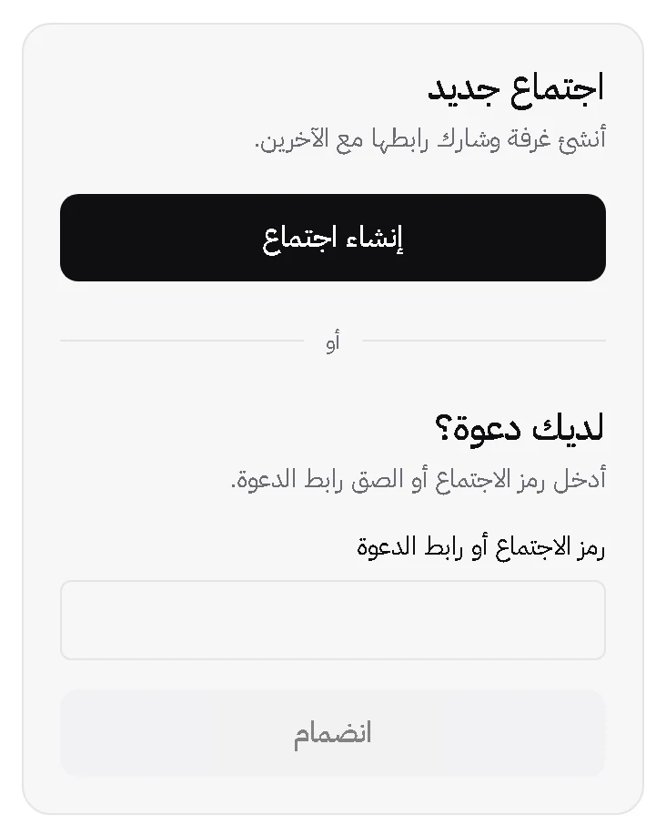

# Product launcher capture / لقطة واجهة بدء الاجتماع

**English alternative:** The Arabic LOR. meeting launcher shows a new-meeting
action, an empty invitation field, and a join action. The join action is inactive
until an invitation is entered.

## Source and intended use

- Source: the shipped Arabic product launcher at `/`, captured from the local
  production build of commit `aca76e69` on 2026-09-25. This is a real interface
  capture, not a generated mockup.
- Capture: fresh Chromium browser context, light theme, 390×844 CSS px viewport,
  2× device scale. The launcher was cropped with 12 CSS px of surrounding space.
  A blank input draft suppressed the example placeholder; no meeting was created
  or joined.
- Deliverable: one WebP image, 732×918 px, 15 KB. Use at no more than 366 CSS px
  wide, preserve its aspect ratio, and keep the adjacent text alternative. The
  current landing page continues to use its responsive HTML/CSS illustration.
- Ownership and licence: captured from LOR. project UI by its maintainers;
  distributed under the repository's AGPL-3.0-only licence. No third-party
  imagery or participant content was added to the capture.

## Privacy and readability review

The cropped image shows only the empty launcher. Visual inspection at its
intended 366 CSS px width found the Arabic heading, field label, and action
labels readable. It contains no participant name or image, room code, transcript,
private meeting content, device label, API key, or browser chrome. The image
has no motion; a poster or transcript is unnecessary. Its descriptive text is
provided above and in both language versions of the [landing brief](landing-brief.md).

## ملاحظات بالعربية

هذه لقطة حقيقية لواجهة بدء الاجتماع العربية في المنتج. التُقطت في جلسة متصفح
جديدة، وأُخفي النص التوضيحي داخل حقل الدعوة بمسودة فارغة. لم يُنشأ اجتماع ولم
يُستخدم رابط دعوة. تظهر أزرار إنشاء الاجتماع والانضمام وحقل الدعوة فقط؛ ولا
تتضمن اللقطة اسماً أو رمز غرفة أو محتوى اجتماع أو مفتاحاً. يُعرض الملف بعرض
لا يتجاوز 366 بكسل CSS مع الحفاظ على نسبة أبعاده، ويُستخدم معه الوصف البديل
المثبت في [قائمة الوسائط العربية](landing-brief.ar.md).
